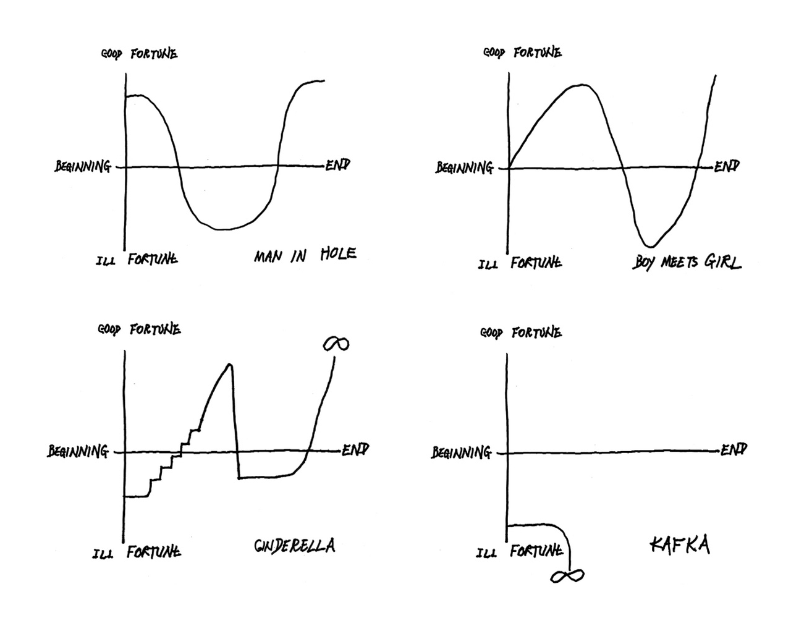
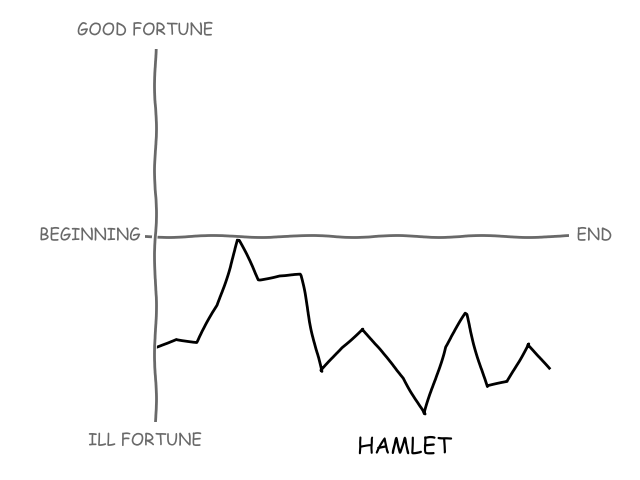
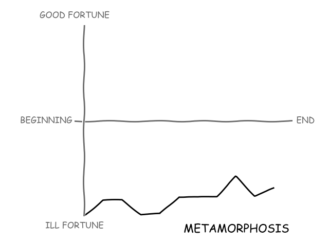
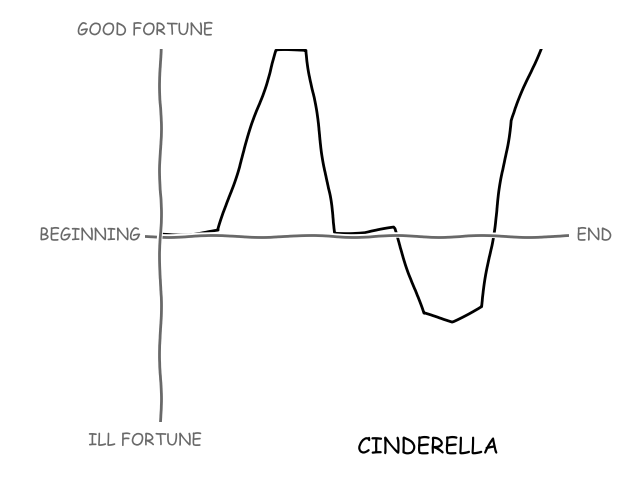
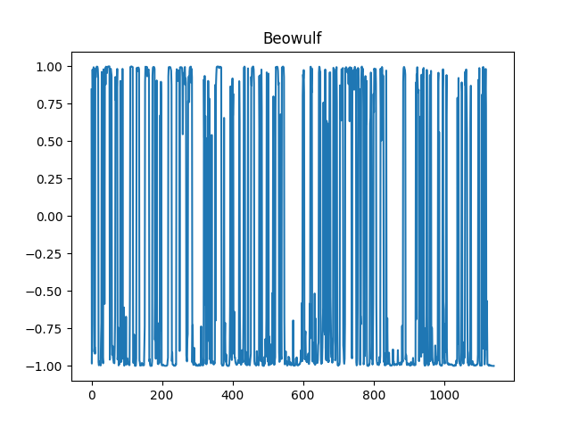

# story-shapes
In the lecture linked below Kurt Vonnegut, author of *Slaughterhouse Five*, *Cat's Cradle*, and others, describes graphing the shapes of stories along two axes.

The image below shows several story shapes that Vonnegut created and appears in his essay collection *A Man Without a Country*.

The lecture and the image above suggest a simple idea for viewing the shape of the story as a graph of the good or ill fortune of its central character(s) from the beginning of the story to the end.

## Experiment

As Vonnegut says, "there's no reason why the shapes of stories can't be fed into computers...", but can we program a computer to generate the shape of a given story on its own?

This project uses a pretrained [transformer model](https://en.wikipedia.org/wiki/Transformer_(machine_learning_model)) to classify the sentiment of passages of a story. The sentiment score (*positive* or *negative*) approximates *good fortune* or *ill fortune* of the story's central characters. Plotting a rolling average of the sentiment score yields a line that traces the shape of the story along Vonnegut's axes.

## Results

How well does this simple approach work? Testing the program on stories that Vonnegut discusses allows us to compare the generated shape to some sort of expected shape.

### *Hamlet* - Shakespeare

In another lecture Vonnegut describes how the ambiguity of *Hamlet* makes it a great story and makes it a difficult story to plot on these two axes. The plot above seems to corroborate that idea. The shape is negative throughout, but does contain significant upward swings.

It would be an interesting exercise to annotate the shape of this plot (and the others below) with the major plot points from the story to see how well the computer-generated shape matches reader expectations.

### *Metamorphosis* - Kafka

The shape of *Metamorphosis* isn't quite as pessimistic as Vonnegut's proposed shape, but the program does generate a shape of general ill fortune.

### *Cinderella*

This shape doesn't quite match what we expect for the *Cinderella* story. The graph shows the central "peak" followed by a "pit" before rising steeply at the end, but I admit that I had to tweak some of the text processing and sizing of the rolling average window to get this result. One problem that *Cinderella* poses for this model is that the text of the story is very short. In order to accumulate enough scores to plot a shape we have to score sentiment over very short segments of the text (i.e., ~100 tokens).

## Discussion

I'm fairly pleased with the results above. Although some hand-engineering went into the parameters used to produce the shapes of these stories the approach and the pretrained transformer model achieved what I was hoping for. I might be able to remove some of the hand-engineering by dynamically selecting story segmentation and window parameters based on the length of the text.

Although the pretrained model yields sentiment scores that render pleasing story shapes we might do better with a model trained (or re-trained) on more representative text. The Hugging Face model was fine-tuned on the [Stanford Sentiment Treebank](https://nlp.stanford.edu/sentiment/index.html).

## Implementation
I use a pretrained sentiment analysis pipeline from the [Hugging Face `transformers`](https://github.com/huggingface/transformers) library to classify the sentiment of story segments.

In order to graph story shapes with a "hand-drawn" appearance I use [matplotlib's XKCD module](https://matplotlib.org/3.2.1/gallery/showcase/xkcd.html).

My first attempt used a sliding window over the story text to track sentiment rather than a rolling average, but the pretrained model scores were too polarized (i.e., mean absolute value over 0.92) to plot a pleasant shape. The image below shows the result of plotting the sentiment of a sliding window of 100 tokens over *Beowulf* with the window advanced one line at a time:

This first approach also suggests a drawback of using a pretrained sentiment analysis model: one cannot alter the maximum input embedding length. The pretrained Hugging Face model has a maximum input length of 512 tokens, so it can only classify the sentiment of short samples of the story. As a result the sliding window approach uses a very small sliding window. Using a rolling average more effectively incorporates sentiment from broader sections of the story.

## References

### Story texts

[*Hamlet*](https://www.gutenberg.org/files/1524/1524-0.txt)

[*Metamorphosis*](https://www.gutenberg.org/cache/epub/5200/pg5200.txt)

[*Cinderella*](https://www.gutenberg.org/files/503/503-0.txt)

### Related work

[*The emotional arcs of stories are dominated by six basic shapes*](https://arxiv.org/abs/1606.07772) by Reagan et. al provides a much more thorough exploration of computational approaches to the shapes of stories.